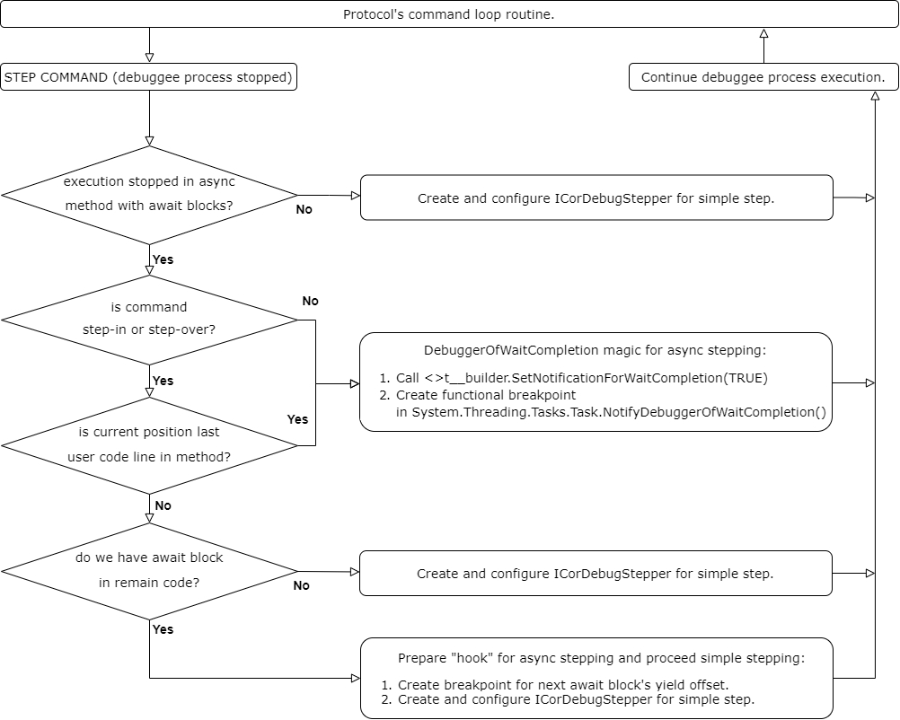
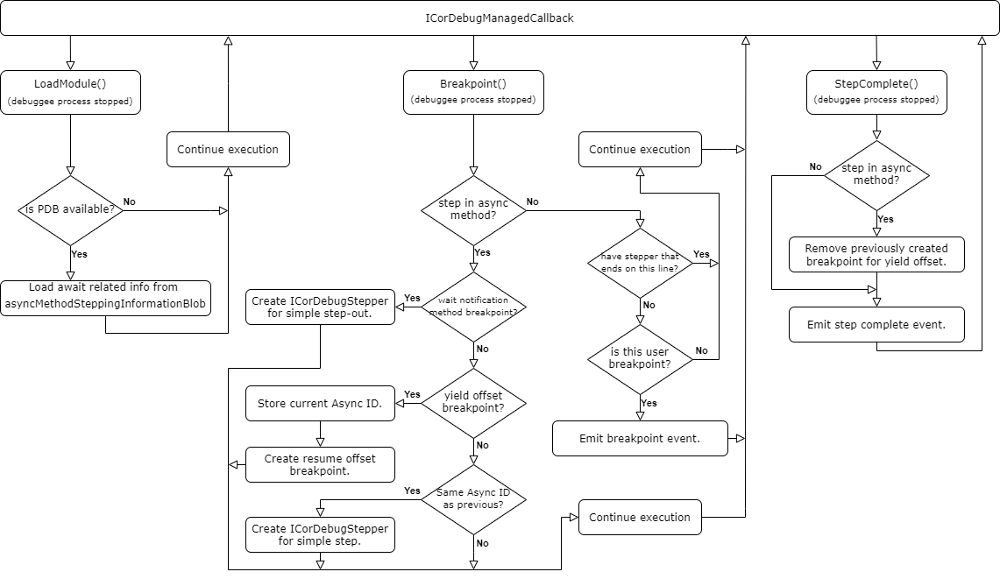
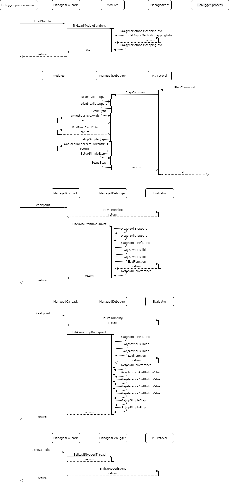

# Stepping implementation in NetcoreDBG.

## Async method stepping.

Overal info about async/await:</br>
https://docs.microsoft.com/en-us/dotnet/csharp/programming-guide/concepts/async/</br>
https://docs.microsoft.com/en-us/dotnet/csharp/language-reference/keywords/async</br>

Good article about async/await realization in Russian:</br>
https://m.habr.com/ru/post/260217/

Main points about async/await in perspective of debugger work:
* At compilation time, async method "converted" to state machine.
* All user code moved into `MoveNext` method.
* PDB provide asyncMethodSteppingInformationBlob with all information debugger need (yield and resume offsets).
* During await execution, thread could be changed.
* Since we have code changed into state machine and thread could be changed, debugger can't use ICorDebugStepper directly.
* State machine's task builder provide `ObjectIdForDebugger` property's getter, that could be called by debugger on yield and resume offsets in order to get unique "async id".

So, main difference that for async method stepping in case method have await block are breakpoints (for yield and resume offsets) and ICorDebugStepper usage instead of ICorDebugStepper only usage. In the same time, since debugger in case of async stepping use breakpoints and could have different thread at resume offset, plus, debuggee process could have parallel execution for same async method, `ObjectIdForDebugger` property's getter must be used in order to track and detect proper thread.

## Yield and resume offsets.

**Yield offset** is point at the beginning of await block code, could be used in order to detect await related code start.
**Resume offset** is point at the end of await block code, where debugger could use ICorDebugStepper for finish step (step from internal await code to closest user code line IL offset).

Example of simple code with async `Main`:

```csharp
static async Task Main(string[] args)
{
    Console.WriteLine("Before await.");
    await Task.Delay(1000);
    Console.WriteLine("After await.");
}
```

`Main` "converted" during compilation into state machine with `MoveNext` method (disassembled by ildasm):

```
.method private hidebysig newslot virtual final 
        instance void  MoveNext() cil managed
{
  .override [System.Runtime]System.Runtime.CompilerServices.IAsyncStateMachine::MoveNext
  // Code size       181 (0xb5)
  .maxstack  3
  .locals init (int32 V_0,
           valuetype [System.Runtime]System.Runtime.CompilerServices.TaskAwaiter V_1,
           class test.Program/'<Main>d__0' V_2,
           class [System.Runtime]System.Exception V_3)
  IL_0000:  ldarg.0
  IL_0001:  ldfld      int32 test.Program/'<Main>d__0'::'<>1__state'
  IL_0006:  stloc.0
  .try
  {
    IL_0007:  ldloc.0
    IL_0008:  brfalse.s  IL_000c
    IL_000a:  br.s       IL_000e
    IL_000c:  br.s       IL_0057
    IL_000e:  nop
    IL_000f:  ldstr      "Before await."
    IL_0014:  call       void [System.Console]System.Console::WriteLine(string)
    IL_0019:  nop
    IL_001a:  ldc.i4     0x3e8
    IL_001f:  call       class [System.Runtime]System.Threading.Tasks.Task [System.Runtime]System.Threading.Tasks.Task::Delay(int32)
    IL_0024:  callvirt   instance valuetype [System.Runtime]System.Runtime.CompilerServices.TaskAwaiter [System.Runtime]System.Threading.Tasks.Task::GetAwaiter()
    IL_0029:  stloc.1
    IL_002a:  ldloca.s   V_1
    IL_002c:  call       instance bool [System.Runtime]System.Runtime.CompilerServices.TaskAwaiter::get_IsCompleted()
    IL_0031:  brtrue.s   IL_0073
    IL_0033:  ldarg.0
    IL_0034:  ldc.i4.0
    IL_0035:  dup
    IL_0036:  stloc.0
    IL_0037:  stfld      int32 test.Program/'<Main>d__0'::'<>1__state'
    IL_003c:  ldarg.0
    IL_003d:  ldloc.1
    IL_003e:  stfld      valuetype [System.Runtime]System.Runtime.CompilerServices.TaskAwaiter test.Program/'<Main>d__0'::'<>u__1'
    IL_0043:  ldarg.0
    IL_0044:  stloc.2
    IL_0045:  ldarg.0
    IL_0046:  ldflda     valuetype [System.Runtime]System.Runtime.CompilerServices.AsyncTaskMethodBuilder test.Program/'<Main>d__0'::'<>t__builder'
    IL_004b:  ldloca.s   V_1
    IL_004d:  ldloca.s   V_2
    IL_004f:  call       instance void [System.Runtime]System.Runtime.CompilerServices.AsyncTaskMethodBuilder::AwaitUnsafeOnCompleted<valuetype [System.Runtime]System.Runtime.CompilerServices.TaskAwaiter,class test.Program/'<Main>d__0'>(!!0&,
                                                                                                                                                                                                                                             !!1&)
    IL_0054:  nop
    IL_0055:  leave.s    IL_00b4
    IL_0057:  ldarg.0
    IL_0058:  ldfld      valuetype [System.Runtime]System.Runtime.CompilerServices.TaskAwaiter test.Program/'<Main>d__0'::'<>u__1'
    IL_005d:  stloc.1
    IL_005e:  ldarg.0
    IL_005f:  ldflda     valuetype [System.Runtime]System.Runtime.CompilerServices.TaskAwaiter test.Program/'<Main>d__0'::'<>u__1'
    IL_0064:  initobj    [System.Runtime]System.Runtime.CompilerServices.TaskAwaiter
    IL_006a:  ldarg.0
    IL_006b:  ldc.i4.m1
    IL_006c:  dup
    IL_006d:  stloc.0
    IL_006e:  stfld      int32 test.Program/'<Main>d__0'::'<>1__state'
    IL_0073:  ldloca.s   V_1
    IL_0075:  call       instance void [System.Runtime]System.Runtime.CompilerServices.TaskAwaiter::GetResult()
    IL_007a:  nop
    IL_007b:  ldstr      "After await."
    IL_0080:  call       void [System.Console]System.Console::WriteLine(string)
    IL_0085:  nop
    IL_0086:  leave.s    IL_00a0
  }  // end .try
  catch [System.Runtime]System.Exception 
  {
    IL_0088:  stloc.3
    IL_0089:  ldarg.0
    IL_008a:  ldc.i4.s   -2
    IL_008c:  stfld      int32 test.Program/'<Main>d__0'::'<>1__state'
    IL_0091:  ldarg.0
    IL_0092:  ldflda     valuetype [System.Runtime]System.Runtime.CompilerServices.AsyncTaskMethodBuilder test.Program/'<Main>d__0'::'<>t__builder'
    IL_0097:  ldloc.3
    IL_0098:  call       instance void [System.Runtime]System.Runtime.CompilerServices.AsyncTaskMethodBuilder::SetException(class [System.Runtime]System.Exception)
    IL_009d:  nop
    IL_009e:  leave.s    IL_00b4
  }  // end handler
  IL_00a0:  ldarg.0
  IL_00a1:  ldc.i4.s   -2
  IL_00a3:  stfld      int32 test.Program/'<Main>d__0'::'<>1__state'
  IL_00a8:  ldarg.0
  IL_00a9:  ldflda     valuetype [System.Runtime]System.Runtime.CompilerServices.AsyncTaskMethodBuilder test.Program/'<Main>d__0'::'<>t__builder'
  IL_00ae:  call       instance void [System.Runtime]System.Runtime.CompilerServices.AsyncTaskMethodBuilder::SetResult()
  IL_00b3:  nop
  IL_00b4:  ret
} // end of method '<Main>d__0'::MoveNext
```

In this case, PDB provide `yield` offset 60 (hex 3C, see `IL_003c` in IL code above) and `resume` offset 87 (hex 57, see `IL_0057` in IL code above).

## Stepping logic, protocol related part block-scheme.

## Stepping logic, runtime callbacks related part block-scheme.

## Sequence diagram for step over await line in async method.

